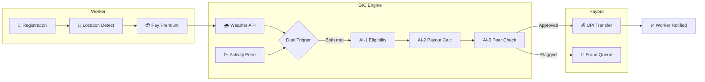

# GIC — Gig Income Coverage

### Guidewire DEVTrails 2026 · Phase 2 Submission · Unicorn Chase

> AI-powered parametric insurance for India's platform-based delivery workers.
> Zero claims. Automatic payouts. Built for the gig economy.

---

## The Problem

India's gig delivery workers (Zomato, Swiggy, Zepto, Amazon Flex) lose **20–30% of their monthly earnings** to external disruptions they cannot control — extreme rain, dangerous AQI, sudden curfews. They have no income protection, no claims process that works for them, and no safety net.

**GIC** solves this with a fully automated parametric insurance platform that:

- Pays workers **before they even know they qualify**
- Requires **zero steps** from the worker to receive a payout
- Operates on a **weekly pricing model** aligned with gig worker earnings cycles
- Covers **loss of income only** — no health, life, accident, or vehicle coverage

---

## Architecture



---

## Website First Look 


## Key Features

### Registration & Location Detection
- 3-step onboarding: Phone OTP → Platform + Worker ID → Zone + UPI
- **Browser Geolocation API** with Haversine distance → nearest zone auto-selected
- Detected zone shown with risk level card and color-coded dot
- Manual dropdown fallback if location is denied

### Premium Payment (Razorpay)
- "Pay Premium →" button inside the worker dashboard sidebar
- Razorpay Checkout (test mode) — real payment modal with UPI/card/netbanking
- Graceful offline fallback: simulates success when SDK unavailable
- On success: payment ID displayed, button locked to "Paid ✓", coverage status updated
- Key served at runtime via `/api/config` — never hardcoded in source

### Dynamic Premium Calculation (AI-1)

```
Weekly Premium = Base (₹29) + Zone Adj + Streak Discount + Forecast Surcharge
Model: GIC-GBT-v3.1 (gradient-boosted claim probability scoring)
Floor: ₹29 / Ceiling: ₹89 / Target BCR: 0.55–0.70
```

| Factor | Example (Adyar) |
|---|---|
| Base premium | ₹29 |
| Zone adjustment (high risk) | +₹12 |
| Streak discount (4 clean weeks) | −₹16 |
| Forecast surcharge (rain expected) | +₹8 |
| **This week** | **₹63** |

### Claims Management (Automated, Zero-Touch)
4-step automated flow — no worker action required:
1. Trigger fires (OpenWeather / CPCB API)
2. Policy eligibility check (active + correct zone + no duplicate)
3. Three-AI fraud verification
4. Payout released via UPI within minutes

### Interactive Dashboard
- **Live SVG map** of Chennai with 6 zone polygons, risk-colored overlays, and worker position
- **Real-time weather cycling** — conditions evolve every 30 seconds in demo
- **"Will I be covered?"** button — instant parametric check against current conditions
- **AI Q&A chatbot** — natural language answers about policy, triggers, and payouts
- **Admin view** — BCR bars per zone, fraud flag queue, platform-wide analytics

---

## The Three-AI Fraud Defense

The most differentiated feature in GIC. No single AI can approve a payout alone.

| AI | Role | Method |
|---|---|---|
| **AI-1** | Premium Engine | GIC-GBT-v3.1 — gradient-boosted scoring · 7-feature vector · claim probability → weekly premium |
| **AI-2** | Payout Calculator | Severity-weighted parametric formula · intensity ratio × activity drop ratio × baseline earnings |
| **AI-3** | Fraud Detection | GIC-IF-v3.1 — isolation forest anomaly detection · 5-signal ensemble · anomaly score 0–1 |

> **AI-3 is the unique signal:** If it's genuinely too rainy to work, *most* workers in that zone show the same activity drop. If peers are active but one worker claims disruption — that's a flag.

---

## Parametric Triggers

| Trigger | Source | Threshold |
|---|---|---|
| Heavy Rainfall | OpenWeather API | >15mm/hr for 30 min |
| Extreme Heat | OpenWeather API | >42°C during shift |
| Severe AQI | CPCB / OpenWeather | AQI >300 |
| Zone Closure | Traffic API (mock) | Blockage above threshold |
| Civic Disruption | Civic Alert Feed | Curfew / strike |

---

## Persona

**Food Delivery Workers — Swiggy/Zomato, Chennai**

Ravi Kumar. Adyar zone. Earns ₹175 lunch / ₹310 dinner on a good day. Loses everything when it rains.

---

## Tech Stack

| Layer | Technology |
|---|---|
| Frontend | HTML5 · CSS3 · Vanilla JS (single-file) |
| Backend | Node.js · Express · File-persisted JSON store |
| AI-1 Premium | GIC-GBT-v3.1 — gradient-boosted scoring (7 features, claim probability → premium) |
| AI-2 Payout | Severity-weighted parametric calculator (intensity × activity drop × baseline) |
| AI-3 Fraud | GIC-IF-v3.1 — isolation forest anomaly detection (5-signal ensemble) |
| AI Chat | Grok (grok-3-mini) via X_AI API — live policy Q&A with system prompt context |
| Maps | Leaflet.js with real Chennai zone polygons |
| Weather | Open-Meteo API (no API key required) · live rainfall data |
| Air Quality | WAQI API (demo token) · live Chennai AQI |
| Payments | Razorpay Checkout (test mode) · UPI |
| Location | Browser Geolocation API + Haversine distance → nearest zone |
| Security | dotenv · `.env.example` pattern · API keys never in source |
| Infra | GitHub Actions · Railway · Vercel |

---

## Running the Project

### 1. Clone & Install

```bash
git clone https://github.com/YOUR_USERNAME/GIC.git
cd GIC
npm install
```

### 2. Configure Environment

```bash
cp .env.example .env
```

Open `.env` and add the required runtime values:
```
MONGODB_URI=your_mongodb_connection_string
RAZORPAY_KEY_ID=rzp_test_YourKeyHere
RAZORPAY_KEY_SECRET=YourSecretHere
XAI_API_KEY=your_xai_key_here
WAQI_TOKEN=demo
```

> Get keys from: [Razorpay Dashboard](https://dashboard.razorpay.com) → Settings → API Keys

### 3. Start the Server

```bash
npm start
# API available at http://localhost:3001
```

### 4. Open the App

Open `http://localhost:3001` in your browser. This project is designed to run through `server.js`, which serves the frontend and the `/api/...` routes from the same origin.

If you open `index.html` directly or use `npx serve`, the UI will still render with mock fallbacks, but that is only a demo mode and not the real app runtime.

### 5. Deploy

Recommended hosting: Render, Railway, Fly.io, or any VPS that can keep a Node process running.

1. Create a web service for this repo.
2. Set the start command to `npm start`.
3. Add the environment variables from `.env.example`.
4. Prefer setting `MONGODB_URI` to a MongoDB Atlas database so claims, workers, and fraud flags persist.
5. Deploy the app as a single Node service so the frontend and API stay on the same origin.

Avoid static-only hosting for the real product. The frontend depends on backend API routes, ML-backed responses, and a recurring trigger monitor started by `server.js`.

---

## Demo Flows

| # | Flow | How to trigger |
|---|---|---|
| 1 | **Onboarding** | Auto-plays on first visit (or click "Watch demo") |
| 2 | **Worker login** | Sign in → Phone `98765 43210` → any 6-digit OTP |
| 3 | **New registration** | Sign in → any other phone → OTP → registration form |
| 4 | **Location detect** | In registration → "Detect my location" button |
| 5 | **Dashboard** | After login → live map, conditions, risk strip |
| 6 | **Coverage check** | Dashboard → "Will I be covered?" button |
| 7 | **Pay premium** | Dashboard sidebar → "Pay Premium →" → Razorpay modal |
| 8 | **Admin dashboard** | Sign in → Admin tab → any credentials |
| 9 | **Dual-trigger demo** | Landing page → interactive sliders |

---

## API Reference

```
GET  /api/health                         Server health + ML engine versions
GET  /api/config                         Frontend config (Razorpay key_id)

POST /api/auth/send-otp                  Send OTP to phone
POST /api/auth/verify-otp               Verify OTP
POST /api/auth/register                 Complete worker registration

GET  /api/worker/:id                     Worker profile
GET  /api/worker/:id/policy              Active policy + ML breakdown
GET  /api/worker/:id/claims              Claims history
POST /api/worker/:id/covered-check       Real-time coverage check
GET  /api/worker/:id/safe-choice         Forecast alert

GET  /api/zone/:key/conditions           Live weather + AQI + adaptive threshold
GET  /api/zone/:key/forecast             7-day risk forecast

POST /api/ai/calculate-premium           AI-1 ML premium with feature importance
POST /api/ai/chat                        Grok chat (X_AI)
GET  /api/ai/model-info                  All ML model metadata
POST /api/claims/trigger-check           Trigger check + AI-3 anomaly score

GET  /api/admin/stats                    Platform-wide metrics
GET  /api/admin/fraud-flags              AI-3 fraud flag queue with anomaly scores
POST /api/admin/fraud-flags/:id/resolve  Resolve flag
GET  /api/admin/zones                    Zones with adaptive thresholds + BCR
```

---

## Project Structure

```
Dev_Trail/
├── index.html          Single-file frontend (HTML + CSS + JS)
├── server.js           Express API server (mock data, 18 endpoints)
├── package.json        Node.js dependencies
├── .env                Environment variables (gitignored)
├── .env.example        Template for .env (committed)
├── .gitignore          Excludes node_modules, .env, OS files
└── README.md           This file
```

---

## For Platforms

GIC is designed as a rider benefit that costs platforms almost nothing:

- **Worker pays** the weekly premium (₹29–89)
- **Platform contributes** a small co-pay or data feed
- **Result:** improved rider retention, reduced churn during bad weather, ESG compliance

---

## Constraints Confirmed

- ✅ Coverage: **loss of income ONLY** — no health, life, accident, vehicle repair
- Pricing: **Weekly** premium model (₹29 base / ₹89 ceiling)
- Persona: **Food delivery** (Swiggy/Zomato), Chennai
- No manual claims process — fully parametric and automated
- Privacy: Location used **only** for zone detection — never stored or shared


## Collaborators

<table align="center">
  <tr>
    <td align="center">
      <a href="https://github.com/Samarth230">
        <br/>
        <sub><b>Samarth230</b></sub>
      </a>
    </td>
    <td align="center">
      <a href="https://github.com/rohanrpais">
        <br/>
        <sub><b>rohanrpais</b></sub>
      </a>
    </td>
    <td align="center">
      <a href="https://github.com/devu2406">
        <br/>
        <sub><b>devu2406</b></sub>
      </a>
    </td>
    <td align="center">
      <a href="https://github.com/Chandroja3011">
        <br/>
        <sub><b>Chandroja3011</b></sub>
      </a>
    </td>
    <td align="center">
      <a href="https://github.com/AryanSingh2025">
        <br/>
        <sub><b>AryanSingh2025</b></sub>
      </a>
    </td>
  </tr>
</table>

---

## Team

**GIC** · Guidewire DEVTrails 2026 · Unicorn Chase
